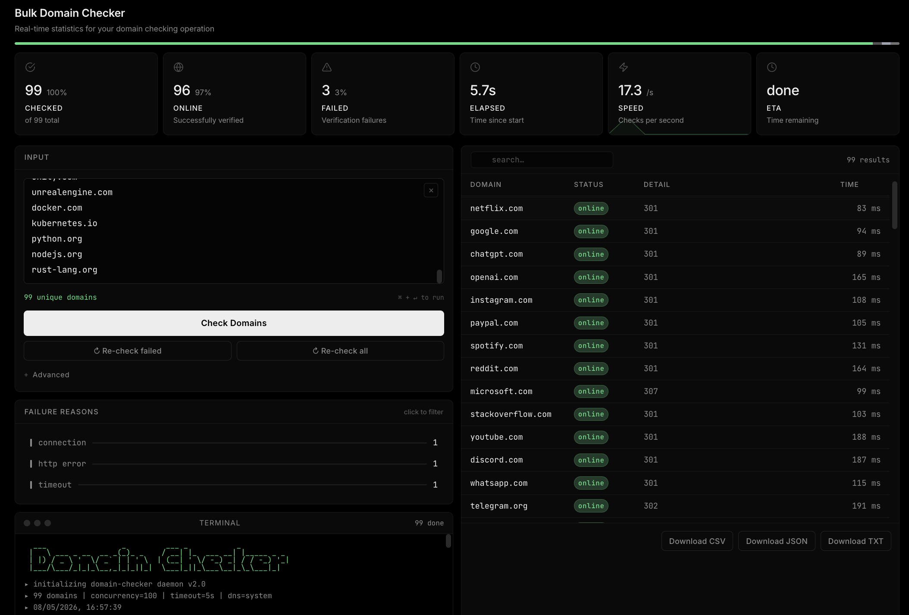

<div align="center">
  

  <h1>What Is Bulk Domain Checker?</h1>

  <p>Bulk Domain Checker checks large hostname lists from a browser or the command line. It streams results as they arrive, reports protocol and timing data, and helps separate DNS failures from HTTP, TLS, timeout, and connection problems.</p>

  <p>It uses FastAPI, httpx, Rich, and a lightweight static frontend. The web app streams newline-delimited JSON for live updates, while the CLI supports both terminal output and machine-readable NDJSON.</p>

  <p>
    <a href="#what-you-get">What You Get</a> •
    <a href="#feature-tour">Feature Tour</a> •
    <a href="#prerequisites">Prerequisites</a> •
    <a href="#quick-start">Quick Start</a> •
    <a href="#cli-usage">CLI Usage</a> •
    <a href="#http-api">HTTP API</a> •
    <a href="#project-layout">Project Layout</a>
  </p>
</div>

## What You Get

Bulk Domain Checker focuses on practical batch verification, not just a pretty table.

- Browser UI and CLI backed by the same checker engine
- Streaming results with status, detail, protocol, and elapsed time
- `system` DNS and public-resolver `direct` DNS for local-vs-public diagnostics
- Failure grouping for DNS, timeout, connection, SSL/TLS, HTTP, and other errors
- Proxy-aware and CA-aware HTTP checks that respect `HTTP_PROXY`, `HTTPS_PROXY`, `NO_PROXY`, `SSL_CERT_FILE`, and `SSL_CERT_DIR`
- Search, sort, detailed result panels with redirect-chain diagnostics, copy, and failure-only re-check workflows
- CSV, JSON, and TXT exports
- Saved browser input, settings, and recent results in `localStorage`
- Simple NDJSON API for scripting and internal tools

## Feature Tour

### Resolver Modes That Answer Different Questions

Bulk Domain Checker supports two DNS modes because the resolver path matters.

- `system` uses `socket.getaddrinfo()` and is useful for local-network checks
- `direct` uses `aiodns` / c-ares against `1.1.1.1`, `8.8.8.8`, and `9.9.9.9`

This makes it easier to tell whether a failure starts in local DNS handling or after resolution.

### HTTPS Checks That Match Browser Reality

- HTTPS is tried first because that is the path browsers use first for most modern sites
- SSL and certificate failures surface as `ssl` results instead of getting hidden by an HTTP redirect
- Proxy and CA environment settings are honoured, so corp-network checks match what users actually see in a browser

### Live Batch Feedback

- Results stream into the browser as each domain finishes instead of waiting for the whole batch
- The dashboard tracks checked count, online rate, failure count, elapsed time, throughput, and ETA
- Failure categories stay filterable during a run, which helps spot patterns inside large lists

### Fast Follow-Up Work

- Re-run only failed domains after a batch completes
- Export the active result set as CSV, JSON, or TXT
- Click any result row for a detail panel with richer diagnostics, redirect-chain lookup, and per-domain exports

### CLI and Automation

- Read domains from a plain text file
- Keep Rich table output for manual review
- Switch to NDJSON with `--json` when the output feeds another tool
- Write a plain text log file alongside the terminal summary

## How It Checks a Domain

Each hostname goes through the same pipeline:

1. Input is normalized to a hostname while preserving the literal host the user entered.
2. DNS resolution runs first using the selected resolver mode.
3. HTTPS is checked first with `HEAD`.
4. A `405 Method Not Allowed` response retries the same URL with `GET`.
5. If HTTPS fails with an SSL or certificate error, the result is reported as `ssl`.
6. If HTTPS fails with a connection-class error, HTTP is tried as a fallback for HTTP-only hosts.
7. A response with status `< 400` marks the domain as online.
8. Otherwise the result falls back to the most useful failure reason that was observed.

This produces a result object with:

- `domain`
- `ok`
- `detail`
- `category`
- `status_code`
- `elapsed_ms`
- `protocol`
- `dns_addresses` when resolution succeeded
- `attempted_protocols`
- `request_method`
- `http_version`
- `redirect_location`
- `server`
- `content_type`

## Prerequisites

Install these before the first run:

- Python 3.10+
- `pip`
- A modern browser if you want the web UI

There is no frontend build step. The web app serves the files in `templates/` and `static/` directly.

## Quick Start

### 1. Install dependencies

**macOS / Linux**

```bash
python3 -m venv .venv
source .venv/bin/activate
pip install -r requirements.txt
```

**Windows PowerShell**

```powershell
python -m venv .venv
.\.venv\Scripts\Activate.ps1
pip install -r requirements.txt
```

### 2. Start the web app

```bash
python app.py
```

Open `http://127.0.0.1:8000`.

### 3. Run a check

- Paste hostnames into the input box, one per line, or drop a `.txt`, `.csv`, or JSON file
- Pick timeout, concurrency, and DNS mode if needed
- Start the run and export the results you want to keep

## CLI Usage

Create an input file with one hostname per line:

```text
example.com
github.com
bad.example
```

Run the checker:

```bash
python check_domains.py domains.txt
```

Useful examples:

```bash
python check_domains.py domains.txt --workers 250 --timeout 8
python check_domains.py domains.txt --dns-mode direct
python check_domains.py domains.txt --json > results.ndjson
python check_domains.py domains.txt --log-file scan.log
```

### CLI Flags

| Flag | Default | Description |
| --- | --- | --- |
| `file` | required | Path to a text file containing hostnames |
| `--timeout` | `5.0` | Per-check timeout in seconds |
| `--workers` | `100` | Maximum concurrent checks |
| `--log-file` | `domain_check.log` | Plain text output log |
| `--json` | off | Emit NDJSON to stdout instead of Rich tables |
| `--dns-mode` | `system` | Resolver mode: `system` or `direct` |

## DNS Modes

### `system`

Use this mode when the question is "does this hostname resolve through the resolver path available on this machine?"

Typical use cases:

- local workstation validation
- VPN or office-network checks
- hosts-file overrides
- resolver-specific troubleshooting

### `direct`

Use this mode when the question is "what do public DNS resolvers return for this hostname?"

Typical use cases:

- comparing public DNS answers against the machine's configured resolver path
- bypassing `/etc/hosts` and local DNS overrides
- narrowing down whether the difference starts at DNS resolution or later in the network path
- checking hosts that may resolve on `A` or `AAAA`

Bulk Domain Checker queries Cloudflare `1.1.1.1`, Google `8.8.8.8`, and Quad9 `9.9.9.9` directly in this mode.

## HTTP API

### `GET /health`

Returns a simple health payload:

```json
{"status":"ok"}
```

### `POST /check`

Starts a streamed batch check and returns `application/x-ndjson`.

Request body:

```json
{
  "domains": ["example.com", "github.com"],
  "timeout": 5,
  "workers": 100,
  "dns_mode": "system"
}
```

Example request:

```bash
curl -N http://127.0.0.1:8000/check \
  -H "Content-Type: application/json" \
  -d '{"domains":["example.com","github.com"],"timeout":5,"workers":100,"dns_mode":"system"}'
```

Example streamed line:

```json
{"domain":"example.com","ok":true,"detail":"301","category":"online","status_code":301,"elapsed_ms":82.4,"protocol":"https"}
```

### Response Fields

| Field | Type | Meaning |
| --- | --- | --- |
| `domain` | `string` | Hostname that was checked |
| `ok` | `boolean` | `true` when a qualifying HTTP response is found |
| `detail` | `string` | Human-readable status or failure detail |
| `category` | `string` | Result bucket such as `online`, `dns`, `timeout`, `connection`, `ssl`, or `http_error` |
| `status_code` | `number \| null` | HTTP status code when available |
| `elapsed_ms` | `number \| null` | Request timing in milliseconds when available |
| `protocol` | `string \| null` | `https` or `http` when available |
| `dns_addresses` | `string[] \| null` | Resolved IPs captured during the DNS preflight when available |
| `attempted_protocols` | `string[] \| null` | Protocols attempted during the check, such as `["https"]` or `["https","http"]` |
| `request_method` | `string \| null` | Final request method used for the returned HTTP response, such as `HEAD` or `GET` |
| `http_version` | `string \| null` | HTTP version reported by the server when available |
| `redirect_location` | `string \| null` | Redirect target from the `Location` header when the response included one |
| `server` | `string \| null` | `Server` header value when available |
| `content_type` | `string \| null` | `Content-Type` header value when available |

## Troubleshooting

- `system` fails and `direct` succeeds: the two resolver paths disagree, which points back to DNS handling on the current machine before the HTTP checks even begin.
- Both modes fail with DNS errors: the hostname does not resolve through either resolver path.
- DNS succeeds but HTTPS fails with `ssl`: the hostname resolves, but the browser-facing TLS configuration is broken.
- DNS succeeds but HTTP fails: the result category points at the next problem layer, usually timeout, connection, TLS, or HTTP status.
- Results on corp networks follow `HTTP_PROXY`, `HTTPS_PROXY`, `NO_PROXY`, `SSL_CERT_FILE`, and `SSL_CERT_DIR`, so proxy and internal CA behavior is part of the final answer.
- The browser UI restores the last saved run automatically when a saved result set is available in `localStorage`.

## Tech Stack

- FastAPI + Uvicorn for the web server
- `httpx` with HTTP/2 enabled for protocol checks
- `aiodns` for direct DNS mode
- Rich + tqdm for CLI output
- Static HTML, Tailwind via CDN, and vanilla JavaScript for the frontend
- `uvloop` on supported Unix systems for faster event-loop performance

## Project Layout

```text
.
├── app.py
├── check_domains.py
├── requirements.txt
├── static/
│   ├── icon.svg
│   └── script.js
├── templates/
│   └── index.html
├── Demo.png
└── README.md
```

### Important Files

- `app.py` exposes the FastAPI app and streamed `/check` endpoint
- `check_domains.py` contains the resolver logic, HTTP checks, CLI entrypoint, and result model
- `static/script.js` drives the live dashboard, exports, filtering, re-check flows, and persistence
- `templates/index.html` contains the web UI shell and styles
